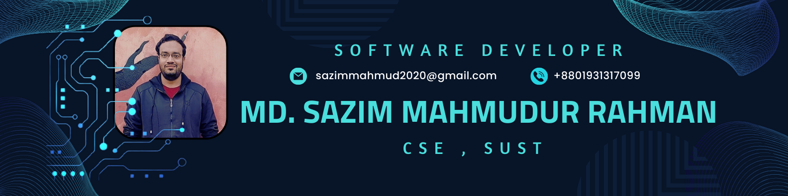

  

###

  
  
  

###

<h1 align="center">👋 I'm Md. Sazim Mahmudur Rahman</h1>

###

<h3 align="left">👩‍💻  About Me</h3>

###

I am a <b><i>Computer Science & Engineering</i></b> student at <b><i>Shahjalal University of Science & Technology</i></b> with a passion for <b>technology</b>, <b>software development</b>, and <b>entrepreneurship</b>. My goal is to build innovative tech solutions that create real-world impact, particularly in desktop, web, android and AI applications.</h4>

###

<h3 align="left">🛠 Language and tools</h3>

###

  
  
  
  
  
  
  
  
  
  
  
  
  
  
  
  
  
  
  
  
  
  
  
  
  
  
  
  
  
  
  
  
  
  
  
  
  
  
  
  
  
  
  
  
  
  
  
  
  

###

<h3 align="left">🔥   My Stats :</h3>

    
    
    
  

###

  

###
